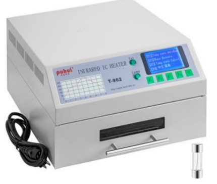

 # SAE Four Project

## Introduction
This project aims to improve the performance of a reflow oven (Reflow oven) used for the production of SMT boards.

## Objectives
1. Design and implement a measurement chain from the sensor to the microcontroller.
2. Use temperature sensors: pt100, thermocouple.
3. Manage a serial link between a PC and a microcontroller using Python.
4. Model and identify a thermal system.
5. Implement and tune a digital controller in a closed-loop setup.
6. Measure the performance of a closed-loop setup.

## Oven Specifications
- Model: Infrared Reflow Oven T-962
- Nominal Power: 800 W
- Maximum Effective Soldering Area: 180 x 235 mm
- Electrical Supply: AC 220 V / 50 Hz
- Temperature Range: 0-280°C
- Cycle Duration: 1-8 min

## Basic Elements
- Metal cover with a human-machine interface
- Oven and drawer for placing the board to be soldered
- Two heating elements (800 W)
- Rear fan for cooling and uniform heating
- Small fan for cooling the control board
- Control board for temperature measurement, control of heating elements and fan, management of the human-machine interface, and temperature regulation

## Added Elements
- Power supply: +/-15V, +/-5V
- 2 static relays for controlling the heating elements and the cooling fan
- 2 thermocouples
- STM32F303k8 microcontroller on Nucleo32 board
- Micro-switches and connectors

## Functionalities

### Measurement Chain
- Convert the oven temperature to a digital value
- Sensor and conditioning to obtain a voltage related to the temperature
- Analog-to-digital conversion (ADC) and processing to obtain the temperature value

### Control Chain
- Control actuators (heating element and fan)
- Modify the power dissipated by the heating element to control temperature rise
- Control the fan speed to control temperature decrease

### Temperature Regulation
- Construct commands for the heating element and fan based on the desired temperature (setpoint) and measured temperature
- Automatic, manual, configuration, and safety modes

### Supervision
- Communication between the microcontroller and the PC via USB serial link and ST-LINK
- Use of Python (Pyserial package) for supervision
- Visualization and modification of the oven configuration from a PC

## Operating Modes

### Automatic Mode
- Automatic operation based on the setpoint and measured temperature
- Monitor the evolution of the oven's state (measured temperature, commands, safety alarms)

### Manual Mode
- User sets the command values
- Record the temperature evolution on the PC

### Configuration Mode
- Modify the controller parameters and temperature setpoint

---
 # Traduction Français
## Introduction
Ce projet a pour objectif d'améliorer les performances d'un four à refusion (Reflow oven) utilisé pour la réalisation de cartes CMS.

## Objectifs
1. Concevoir et mettre en œuvre une chaîne de mesure du capteur au microcontrôleur.
2. Utiliser des capteurs de températures : pt100, thermocouple.
3. Gérer une liaison série entre un PC et un microcontrôleur en Python.
4. Modéliser et identifier un système thermique.
5. Mettre en œuvre et régler un correcteur numérique dans un montage en boucle fermée.
6. Mesurer les performances d'un montage en boucle fermée.

## Spécifications du Four 
- Modèle : Four de Refusion à Infrarouge T-962
- Puissance Nominale : 800 W
- Zone Maximale de Soudure Efficace : 180 x 235 mm
- Alimentation Électrique : AC 220 V / 50 Hz
- Gamme de Température : 0-280°C
- Durée du Cycle : 1-8 min

## Éléments de Base 
- Capot métallique avec interface homme/machine
- Four et tiroir pour déposer la carte à souder
- Deux éléments chauffants (800 W)
- Ventilateur arrière pour refroidissement et chauffage homogène
- Petit ventilateur pour refroidissement de la carte de commande
- Carte de commande pour mesure de température, commande des éléments chauffants et ventilateur, gestion de l'interface homme/machine et régulation de température

## Éléments Ajoutés 
- Alimentation : +/-15V, +/-5V
- 2 relais statiques pour la commande des éléments chauffants et du ventilateur
- 2 thermocouples
- Microcontrôleur STM32F303k8 sur carte Nucleo32
- Micro-switchs et connectique

## Fonctionnalités 

### Chaîne de Mesure 
- Convertir la température du four en une valeur numérique
- Capteur et mise en forme pour obtenir une tension reliée à la température
- Conversion analogique/numérique (ADC) et traitement pour obtenir la valeur de la température

### Chaîne de Commande 
- Contrôler les actionneurs (élément chauffant et ventilateur)
- Modifier la puissance dissipée par l'élément chauffant pour contrôler l'élévation de température
- Contrôler la vitesse du ventilateur pour contrôler la baisse de température

### Régulation de Température
- Construire les commandes de l'élément chauffant et du ventilateur en fonction de la température désirée (consigne) et de la température mesurée
- Mode automatique, manuel, de configuration et de mise en sécurité

### Supervision 
- Communication entre le microcontrôleur et le PC via liaison série USB et ST-LINK
- Utilisation de Python (package Pyserial) pour la supervision
- Visualisation et modification de la configuration du four à partir d'un PC

## Modes de Fonctionnement 

### Mode Automatique
- Fonctionnement automatique basé sur la consigne et la mesure de la température
- Suivi de l'évolution de l'état du four (température mesurée, commandes, alarmes de sécurité)

### Mode Manuel 
- Réglage des valeurs des commandes par l'utilisateur
- Enregistrement de l'évolution de la température sur le PC

### Mode de Configuration 
- Modification des paramètres du correcteur et de la consigne de température
